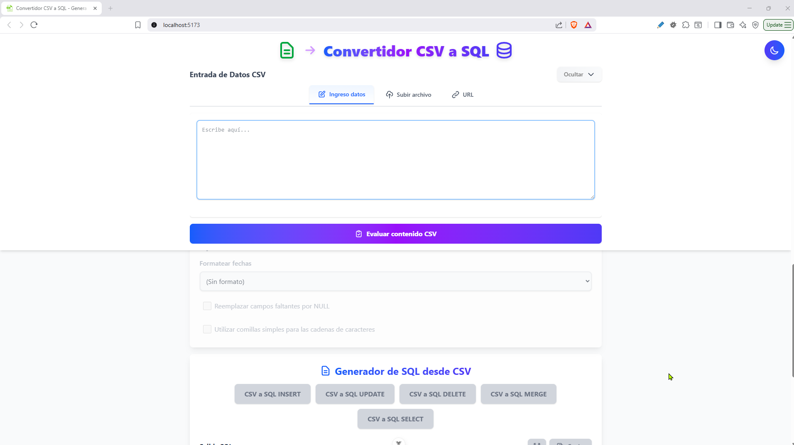
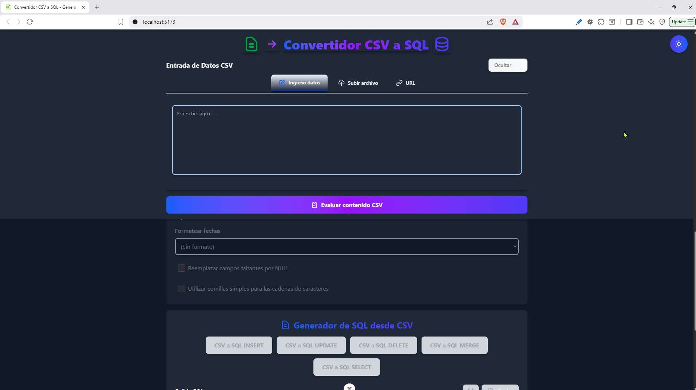
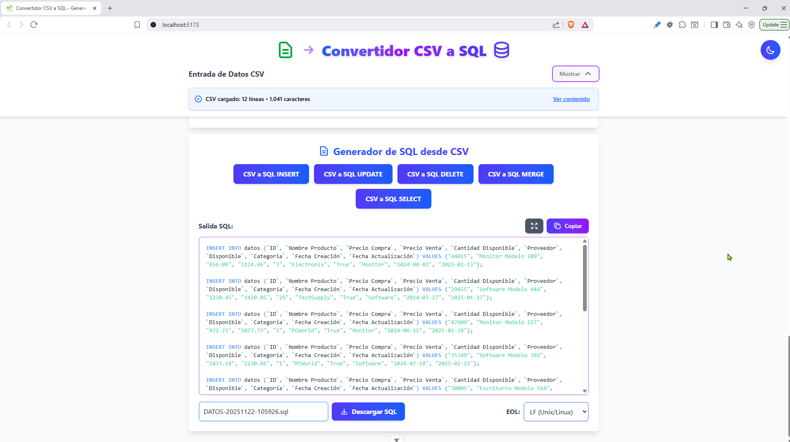
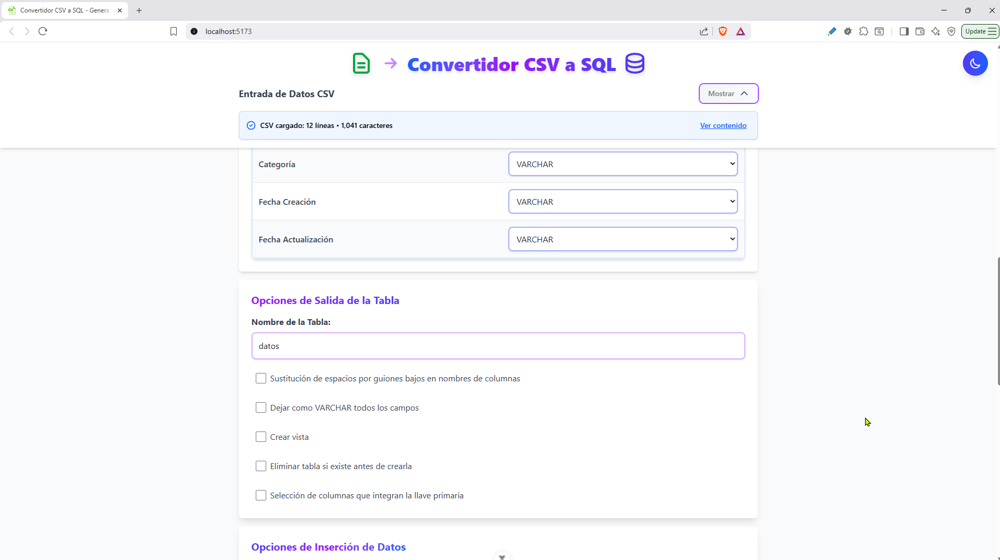
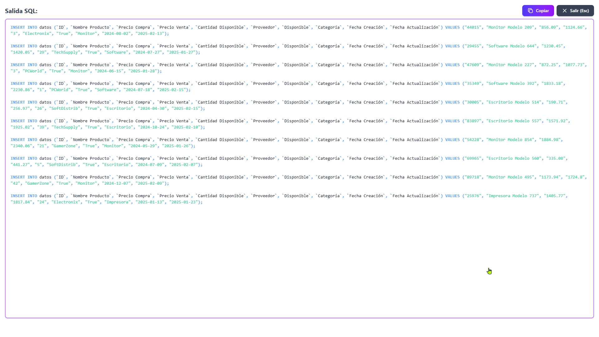

# 📊 Convertidor CSV a SQL


Una aplicación web moderna y potente para convertir archivos CSV a código SQL de forma rápida, sencilla y profesional. Genera sentencias SQL optimizadas para múltiples sistemas de gestión de bases de datos.

## 📖 Introducción

**Convertidor CSV a SQL** es una herramienta web desarrollada con Vue.js que permite transformar archivos CSV en código SQL listo para usar. La aplicación ofrece una interfaz intuitiva y moderna con soporte para modo claro y oscuro, syntax highlighting, y múltiples opciones de personalización.

### ¿Por qué usar esta herramienta?

- ✅ **Rápida y eficiente**: Convierte archivos CSV a SQL en segundos
- ✅ **Múltiples SGBD**: Soporta MySQL, PostgreSQL, SQLite y SQL Server
- ✅ **Diversos tipos de sentencias**: INSERT, UPDATE, DELETE, MERGE y SELECT
- ✅ **Interfaz moderna**: Diseño responsive con modo oscuro/claro
- ✅ **Código formateado**: SQL con syntax highlighting y formato profesional
- ✅ **Sin instalación**: Funciona directamente en el navegador
- ✅ **100% gratuito y de código abierto**

## 🚀 Funcionalidades

### 📥 Entrada de Datos

- **Carga desde archivo**: Sube archivos CSV desde tu dispositivo
- **Carga desde URL**: Importa archivos CSV directamente desde una URL
- **Detección automática de delimitadores**: Coma, punto y coma, tabulación, etc.
- **Delimitador personalizado**: Define tu propio separador de campos
- **Opciones de procesamiento**:
  - Primera fila como encabezados
  - Límite de líneas a leer
  - Saltar líneas específicas

### 🗄️ Configuración de Base de Datos

- **Soporte para múltiples SGBD**:
  - MySQL
  - PostgreSQL
  - SQLite
  - SQL Server
- **Sintaxis personalizable**: Adapta el código SQL según el motor de base de datos

### 📤 Generación de SQL

#### Tipos de Sentencias Disponibles:

1. **INSERT**: Genera sentencias INSERT para insertar datos
   - Soporte para REPLACE
   - Múltiples cláusulas VALUES
   - Modificadores adicionales (IGNORE, LOW_PRIORITY, etc.)

2. **UPDATE**: Crea sentencias UPDATE basadas en llaves primarias
   - Actualización de registros existentes
   - Soporte para llaves primarias simples y compuestas

3. **DELETE**: Genera sentencias DELETE
   - Eliminación basada en llaves primarias
   - Soporte para llaves primarias compuestas

4. **MERGE/UPSERT**: Crea sentencias MERGE para sincronización
   - MySQL: `INSERT ... ON DUPLICATE KEY UPDATE`
   - PostgreSQL/SQLite: `INSERT ... ON CONFLICT ... DO UPDATE`
   - SQL Server: `MERGE`

5. **SELECT**: Genera consultas SELECT
   - Selección de registros específicos
   - Basado en llaves primarias

### ⚙️ Opciones de Configuración

#### Opciones de Tabla:
- Nombre personalizado de tabla
- Sustitución de espacios por guiones bajos
- Forzar todos los campos como VARCHAR
- Crear vista
- Eliminar tabla si existe
- Selección de llave primaria (simple o compuesta)

#### Opciones de Formato:
- Formateo de fechas (múltiples formatos disponibles)
- Reemplazo de campos faltantes por NULL
- Uso de comillas simples o dobles

#### Opciones de Inserción:
- Usar REPLACE en lugar de INSERT
- Múltiples cláusulas VALUES
- Modificadores adicionales según el SGBD

### 🎨 Características de la Interfaz

- **Modo oscuro/claro**: Toggle entre temas con un solo clic
- **Syntax highlighting**: Código SQL con colores intensos y legibles
- **Formato automático**: SQL formateado profesionalmente
- **Pantalla completa**: Vista ampliada del código SQL generado
- **Copia rápida**: Copia el código SQL con un solo clic
- **Descarga de archivos**: Descarga el SQL generado con formato personalizado
- **Selección de EOL**: Elige el formato de fin de línea (LF, CRLF, CR)

## 🛠️ Tecnologías Utilizadas

### Frontend Framework
- **Vue.js 3.5.13**: Framework JavaScript progresivo
- **Vite 6.0.11**: Build tool y dev server ultrarrápido

### Estilos y UI
- **Tailwind CSS 4.0.4**: Framework CSS utility-first
- **Diseño responsive**: Adaptable a todos los dispositivos

### Librerías Principales
- **PapaParse 5.5.2**: Parsing de archivos CSV
- **sql-formatter 15.6.10**: Formateo profesional de código SQL
- **Prism.js 1.30.0**: Syntax highlighting para SQL
- **Pinia 2.3.1**: Gestión de estado
- **Vue Router 4.5.0**: Enrutamiento (preparado para futuras expansiones)

### Herramientas de Desarrollo
- **ESLint**: Linter para mantener calidad de código
- **Prettier**: Formateador de código
- **Vue DevTools**: Herramientas de desarrollo para Vue

## 📋 Requisitos Previos

Antes de instalar y ejecutar la aplicación, asegúrate de tener instalado:

- **Node.js** (versión 16 o superior)
- **npm** (versión 7 o superior) o **yarn**

### Verificar Instalación

```bash
node --version
npm --version
```

## 🔧 Instalación

### 1. Clonar el Repositorio

```bash
git clone https://github.com/Fhernd/proy10_convertidor_csv_sql.git
cd proy10_convertidor_csv_sql
```

### 2. Instalar Dependencias

```bash
npm install
```

Este comando instalará todas las dependencias necesarias listadas en `package.json`.

## ▶️ Ejecución

### Modo Desarrollo

Para ejecutar la aplicación en modo desarrollo con hot-reload:

```bash
npm run dev
```

La aplicación estará disponible en `http://localhost:5173`

### Compilar para Producción

Para generar una versión optimizada para producción:

```bash
npm run build
```

Los archivos compilados se generarán en la carpeta `dist/`.

### Vista Previa de Producción

Para previsualizar la versión de producción localmente:

```bash
npm run preview
```

### Linting y Formateo

```bash
# Ejecutar ESLint
npm run lint

# Formatear código con Prettier
npm run format
```

## 🌐 Demo en Vivo

Puedes probar la aplicación directamente en GitHub Pages:

🔗 **[Ver Demo en GitHub Pages](https://fhernd.github.io/proy10_convertidor_csv_sql/)**

> **Nota**: Si la aplicación aún no está desplegada en GitHub Pages, puedes seguir las instrucciones de despliegue más abajo.

## 📸 Capturas de Pantalla

### Vista Principal - Modo Claro

*Interfaz principal de la aplicación en modo claro*

### Vista Principal - Modo Oscuro

*Interfaz principal de la aplicación en modo oscuro*

### Generación de SQL

*Código SQL generado con syntax highlighting*

### Opciones de Configuración

*Panel de opciones de configuración avanzadas*

### Pantalla Completa

*Vista de pantalla completa del código SQL*

> **Nota**: Las capturas de pantalla se pueden agregar en la carpeta `docs/screenshots/` del repositorio.

## 📚 Guía de Uso

### Paso 1: Cargar Datos CSV

1. Haz clic en la pestaña **"Archivo"** o **"URL"**
2. Sube un archivo CSV o ingresa una URL
3. La aplicación detectará automáticamente el delimitador

### Paso 2: Configurar Opciones

1. Ajusta las **Opciones de Entrada** según tu archivo CSV
2. Selecciona el **Sistema de Gestión de Base de Datos** (MySQL, PostgreSQL, etc.)
3. Configura los **Tipos de Datos** de las columnas
4. Personaliza las **Opciones de Tabla** (nombre, llave primaria, etc.)

### Paso 3: Generar SQL

1. Elige el tipo de sentencia SQL que deseas generar:
   - CSV a SQL INSERT
   - CSV a SQL UPDATE
   - CSV a SQL DELETE
   - CSV a SQL MERGE
   - CSV a SQL SELECT

2. El código SQL se generará automáticamente con formato y syntax highlighting

### Paso 4: Copiar o Descargar

- **Copiar**: Haz clic en el botón "Copiar" o haz clic directamente en el área de código
- **Descargar**: Ingresa un nombre de archivo y haz clic en "Descargar SQL"
- **Pantalla completa**: Usa el botón de pantalla completa para una mejor visualización

## 🚀 Despliegue

### GitHub Pages

Para desplegar la aplicación en GitHub Pages:

1. **Configurar el repositorio**:
   ```bash
   # Asegúrate de estar en la rama main
   git checkout main
   ```

2. **Instalar gh-pages** (opcional, o usar GitHub Actions):
   ```bash
   npm install --save-dev gh-pages
   ```

3. **Agregar script al package.json**:
   ```json
   "scripts": {
     "deploy": "npm run build && gh-pages -d dist"
   }
   ```

4. **Desplegar**:
   ```bash
   npm run deploy
   ```

5. **Configurar en GitHub**:
   - Ve a Settings > Pages
   - Selecciona la rama `gh-pages` como fuente
   - La aplicación estará disponible en `https://[tu-usuario].github.io/proy10_convertidor_csv_sql/`

### Vercel

```bash
npm install -g vercel
vercel
```

### Netlify

Arrastra y suelta la carpeta `dist` en [Netlify Drop](https://app.netlify.com/drop)

## 🤝 Contribuir

Las contribuciones son bienvenidas. Por favor:

1. Fork el proyecto
2. Crea una rama para tu feature (`git checkout -b feature/AmazingFeature`)
3. Commit tus cambios (`git commit -m 'Add some AmazingFeature'`)
4. Push a la rama (`git push origin feature/AmazingFeature`)
5. Abre un Pull Request

## 📝 Licencia

Este proyecto está bajo la Licencia MIT. Ver el archivo `LICENSE` para más detalles.

## 👤 Autor

**Fhernd**

- GitHub: [@Fhernd](https://github.com/Fhernd)
- Repositorio: [proy10_convertidor_csv_sql](https://github.com/Fhernd/proy10_convertidor_csv_sql)

## 🙏 Agradecimientos

- [Vue.js](https://vuejs.org/) - Framework JavaScript progresivo
- [Tailwind CSS](https://tailwindcss.com/) - Framework CSS utility-first
- [PapaParse](https://www.papaparse.com/) - Parser CSV rápido y potente
- [sql-formatter](https://github.com/sql-formatter-org/sql-formatter) - Formateador de SQL
- [Prism.js](https://prismjs.com/) - Syntax highlighting

## 📞 Soporte

Si encuentras algún problema o tienes sugerencias:

- Abre un [Issue](https://github.com/Fhernd/proy10_convertidor_csv_sql/issues) en GitHub
- Contacta al autor a través de GitHub

---

⭐ Si este proyecto te resulta útil, ¡no olvides darle una estrella en GitHub!
